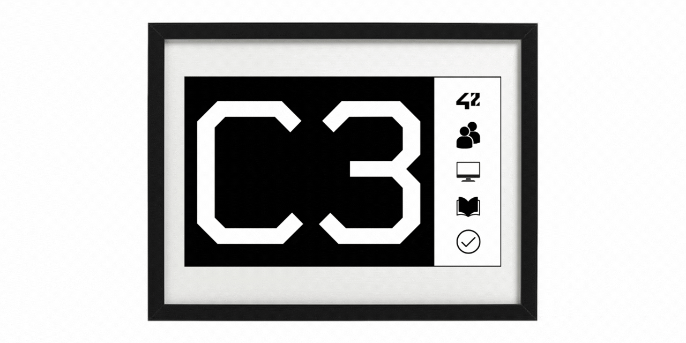

# 42 Smart Cluster Sign
## Table of Contents

- [Introduction](#introduction)
- [Usage](#usage)
- [Features](#features)
- [Components](#components)
- [The Team behind the Sign](#the-team-behind-the-sign)
- [Regards](#regards)
- [Contributing to the Project](#contributing-to-the-project)
- [License](#license)
- [Conclusion](#conclusion)

## Introduction

Welcome to the README for the 42 Smart Cluster Sign — a self-sufficient information display designed to be installed on a cluster door. Its purpose is to notify students when the cluster is reserved for an exam and prevent them from accidental entering. The device automatically retrieves exam dates from Intra and displays appropriate warnings and information on its e-paper screen. In the spare time it simply displays the cluster number.

For more information, please, refer to the technical documentation in the docs folder of this repository.

## Usage

Once the 42 Smart Cluster Sign is installed and powered on, it will automatically retrieve exam dates from Intra and update the display accordingly. The device operates in the following states:
1. **Normal state**: The device displays the number of the cluster, accompanied by pictograms that depict some of the cluster use cases: cooperating with fellow peers, working on a computer, and studying from books. The last pictogram indicates "free to enter" contrasting with the "do not enter" cross pictogram that appears during exams. In case the Sign needs to communicate an issue with its operation, the pictograms are replaced with an appropriate error message, e.g.: "Low battery" or "Could not get exam info".
2. **Pre-exam warning**: Early in the morning of an exam day, the device hides the pictograms and adds a small informational note about the upcoming exam later in the day. This way, students who want to settle into the room can plan their work ahead with the cluster availability limitations in mind.
3. **1-hour countdown**: 1 hour before the exam, a countdown begins. The device no longer displays the cluster number but a full-screen sign with the minutes left until the exam, indicating to students that it is time to vacate the classroom.
4. **Exam in progress**: During the exam, the device displays a big bright-red warning sign indicating the ongoing exam. The drastically changed colour palette attracts attention, enhancing the sign's effectiveness.
5. **Post-exam state**: After the exam ends, the Sign returns to its normal state, displaying the number of the cluster.

## Features

- Highly autonomous operation: the Sign operates fully autonomously and does not require any input from the school personnel;
- Automatic exam time check: the Sign keeps track of the exams published on Intra on its own;
- Adaptation to changes: the Sign can adapt its behaviour to some unusual exam scheduling, such as last-minute cancellations, varying exam lengths, or sequences of several immediate exams;
- Exam subscribers check: if there is noone undertaking the exam, the Sigh will know it and will not block the room;
- Automatic battery charge monitoring: you will surely know when to charge the device;
- Deep Sleep mode: the microcontroller sleeps most of the time and wakes up only when it has a task to do, drastically saving the battery charge;
- Telegram enabled: control the Sign, update its security token, and receive operational information — all remotely, via your Telegram chat;
- Over The Air firmware update: develop and upload new features without the need of looking for a cable;
- Watchdog: no program failure can stop the Sign as its inner watchdog makes sure the program execution does not get stuck;
- Low-maintenance design: the 4000mAh battery ensures long periods of operation - up to a few months - between recharges, which require a standard USB-C cable and any 5V power adapter. During recharging, the Sign remains fully operational.

## Components

The following components are used in the 42 Smart Cluster Sign:
1. **Seeed Studio XIAO ESP32C3 Wi-Fi module**: provides connectivity to the Internet for retrieving exam dates, updates the display, takes care of the battery with its battery management and charging circuit — all of that while rocking modern USB-C port for charging and easy software updating.
2. **Good Display GDEY075Z08 7.5" 800x480 ePaper black/red/white SPI display**: a high-resolution display that allows for clear and easy-to-read information.
3. **Good Display DESPI-C02 universal SPI e-Paper adapter**: transforms display's FPC interface into microcontroller's SPI.
4. **4000mAh Li-ion battery with overcharge and undercharge protection**: powers the device and ensures continuous operation.
5. **IKEA RÖDALM photo frame, black, 13x18 cm**: made a good enclosure.
6. **Custom 3D-printed board**: to hold all the electronics in place.

For more information, please, refer to the bill of materials in the docs folder of this repository.

## Contributing to the Project

Contributions to the 42 Smart Cluster Sign project are very welcome! Contact the repository admin [**HERE**](https://www.linkedin.com/in/roman-alexandrov-a75b89195/) to be added as a Collaborator*. The best place to start would be the [**Issues**](https://github.com/RomanAlexandroff/42-Smart-Cluster-Sign/issues) tab of this repository. It most likely already contains a list of features we'd appreciate your help with and you can start working on them right away. If you have your own ideas, bug fixes, or improvements, feel free to open an issue or submit a pull request.

When contributing, please adhere to the existing code style and follow the established guidelines. Clearly describe your changes and provide any necessary documentation or tests.

*Since the device is intended for use within the 42 network of schools, its development requires personal access to the internal information system. For this reason, only a student or a member of the Bocal staff at a 42 school can become a Collaborator on this project.

## The Team behind the Sign

This project is a group effort of various 42 students with support from the 42 Prague Bocal team. Here they are:
- **roaleksa**, 42 Roma, [linkedin](https://www.linkedin.com/in/roman-alexandrov-a75b89195/) — software and electronic hardware developer. Made the idea reality,
- **gsura**, 42 Heilbronn, [linkedin](https://www.linkedin.com/in/grigore-sura-781025b6/) — idea starter and motivation supporter. Pitched the idea to Bocal so well they ended up asking for two devices,
- **cgray**, 42 Prague, [linkedin](https://www.linkedin.com/in/cullen-gray-42prg/) — hardware development. Modeled beautiful and functional inner frame for the electronics,
- **phelebra**, 42 Prague, [linkedin](https://www.linkedin.com/in/petr-helebrant-55805647/) — 3D printing. Turned 3D model into high-quality pieces of hardware.
- **arosado-**, 42 Lisboa, [linkedin](https://www.linkedin.com/in/andré-hernández-0572a1238/) — 42 API expert. Tought how to get the data from the 42 servers,
- **jrathelo**, 42 Nice, [linkedin](https://www.linkedin.com/in/jolan-rathelot-017bb6252/) — memory wizard. Helped resolve the microcontroller's RAM overflow,
- **psimcak**, 42 Prague, [linkedin](https://www.linkedin.com/in/petr-simcak/) — support master. Keeps the 42 Prague's Sign up and running, improved the Sign's reliability multiple times.

## Regards

The project is based on Jean-Marc Zingg's [GxEPD2](https://github.com/ZinggJM/GxEPD2) library for e-paper displays.
The project uses the [ArduinoOTA](https://github.com/jandrassy/ArduinoOTA) library by Juraj Andrassy for the Over-The-Air software update functionality.
The Sign's Telegram Bot functionality is provided by Brian Lough's [UniversalTelegramBot](https://github.com/witnessmenow/Universal-Arduino-Telegram-Bot) library.

## License

The 42 Smart Cluster Sign project is licensed. Please, familiarise yourself with the license before using the software or working on it. The text of the license can be found in this repository.

Please note that while the project strives to provide accurate information, it is provided "as is" without any warranty. Use the project at your own risk.

## Conclusion

Thank you for your interest in the 42 Smart Cluster Sign project! We hope this README provides you with the necessary information to understand the project's purpose, features, installation process, usage, and maintenance. If you did not find the information you need, please, refer to the technical documentation in this repository. If you have any further questions or need assistance, please don't hesitate to reach out. Happy coding!